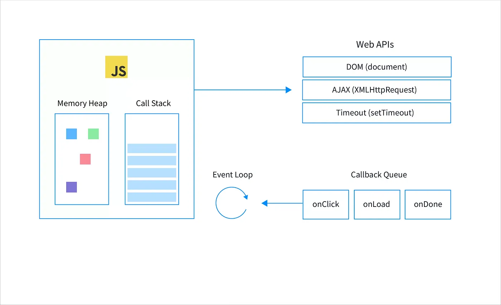

# Modulo 3 Taller 2

## Como funciona el Event Loop

El Event Loop verifica continuamente la cola de eventos en busca de tareas. Si el context de ejecución principal está vacío y la cola de eventos tiene tareas esperando para ser ejecutadas, el Event Loop las retirará una por una y ejecutará sus funciones de devolución de llamada.

